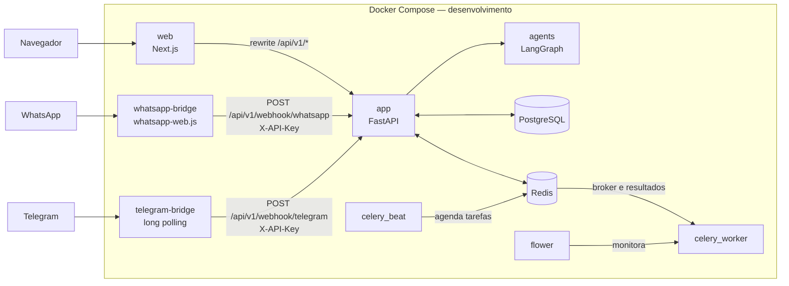

# bagCoin — Assistente Financeiro Pessoal

[](https://github.com/Guisandroni/bagCoin/actions/workflows/test.yml)

O bagCoin é um assistente financeiro pessoal multicanal. A mesma identidade de Usuário pode administrar dados financeiros pela aplicação web, pelo WhatsApp ou pelo Telegram.

Ele registra Transações, organiza Categorias, acompanha Orçamentos e Metas, mantém Contas e Cartões de Crédito, processa Conversas e gera Relatórios em PDF ou CSV.

## Visão do produto

O produto transforma texto, áudio, imagens de comprovantes e documentos em dados financeiros estruturados. Antes de persistir uma ação financeira extraída de uma conversa, o agente pode solicitar uma Confirmação Pendente ao usuário.

- **Transações:** receitas ou despesas associadas a valor, data, Categoria e descrição.
- **Orçamentos:** limites mensais por Categoria, usados para acompanhar gastos.
- **Metas:** objetivos financeiros com valor-alvo, prazo e progresso.
- **Relatórios:** resumos financeiros exportados sob demanda em PDF ou CSV.
- **Canais:** a web, o WhatsApp e o Telegram usam o mesmo backend e pertencem ao mesmo Usuário.

Os termos de domínio e suas definições completas estão em [CONTEXT.md](CONTEXT.md).

## Arquitetura em uma visão


```mermaid
flowchart LR
    Browser[Navegador] --> Web[web<br/>Next.js]
    WhatsApp[WhatsApp] --> WABridge[whatsapp-bridge<br/>whatsapp-web.js]
    Telegram[Telegram] --> TGBridge[telegram-bridge<br/>long polling]

    subgraph Compose["Docker Compose — desenvolvimento"]
        Web -->|rewrite /api/v1/*| API[app<br/>FastAPI]
        WABridge -->|POST /api/v1/webhook/whatsapp<br/>X-API-Key| API
        TGBridge -->|POST /api/v1/webhook/telegram<br/>X-API-Key| API
        API --> Agent[agents<br/>LangGraph]
        API <--> DB[(PostgreSQL)]
        API <--> Redis[(Redis)]
        Beat[celery_beat] -->|agenda tarefas| Redis
        Redis -->|broker e resultados| Worker[celery_worker]
        Flower[flower] -->|monitora| Worker
    end
```

O navegador chama caminhos relativos `/api/v1/*`. O Next.js reescreve essas chamadas para `API_URL`; no Compose, esse destino é `http://app:8000/api/v1`, sem expor o backend diretamente ao navegador.

## Chatbot no WhatsApp

As capturas abaixo mostram fluxos reais suportados pela conversa: registro e confirmação de Transações, leitura de comprovantes, ajustes de Orçamento, Metas e Relatórios.

<table>
  <tr>
    <td align="center">
      
      <br />
      <sub>Transação por texto e comprovante</sub>
    </td>
    <td align="center">
      
      <br />
      <sub>Confirmação de Transação extraída de comprovante</sub>
    </td>
  </tr>
  <tr>
    <td align="center">
      
      <br />
      <sub>Áudio, confirmação e ajuste de Orçamento</sub>
    </td>
    <td align="center">
      
      <br />
      <sub>Criação e consulta de Meta</sub>
    </td>
  </tr>
  <tr>
    <td align="center" colspan="2">
      
      <br />
      <sub>Geração e entrega de Relatório em PDF</sub>
    </td>
  </tr>
</table>

## Stack

| Domínio | Tecnologias | Papel no sistema |
|---|---|---|
| Backend | Python 3.11, FastAPI, Uvicorn, Pydantic v2, SQLAlchemy async, asyncpg, Alembic | API HTTP, validação, regras de negócio, persistência e migrações. |
| Dados | PostgreSQL 16 | Fonte de dados para Usuários, dados financeiros, Conversas e arquivos relacionados. |
| Cache e filas | Redis 7, Celery 5, Celery Beat, Flower | Cache, broker e backend de resultados; execução, agendamento e monitoramento de tarefas. |
| Agente de IA | LangGraph, LangChain | Orquestração de Intenções, entrada multimodal, confirmações e respostas. |
| Provedores de IA | OpenAI, Groq, DeepSeek, Gemini | Capacidades configuráveis de modelo, transcrição e visão; configure apenas os provedores necessários ao fluxo usado. |
| Frontend | Next.js 16, React 19, TypeScript, Tailwind CSS v4, shadcn/ui, TanStack Query, Axios, Zustand, Zod | Interface web, estado de cliente, validação e acesso à API. |
| WhatsApp | Node 18, Express, `whatsapp-web.js`, Chromium | Sessão WhatsApp Web, QR de associação e ponte HTTP para o backend. |
| Telegram | Python 3.11, `httpx`, long polling | Recebimento de atualizações, download de mídia e ponte HTTP para o backend. |
| Observabilidade | Logfire, LangSmith | Instrumentação e rastreamento configuráveis. |
| Testes | pytest, Vitest, Playwright | Testes do backend, frontend, bridge WhatsApp e fluxos E2E. |

## Responsabilidades dos componentes

| Componente | Local/serviço | Responsabilidade |
|---|---|---|
| API e domínio | `apps/server` / `app` | Expõe a API versionada, aplica autenticação, coordena casos de uso e integra o agente. |
| Interface web | `apps/web` / `web` | Entrega dashboard e telas financeiras; encaminha `/api/v1/*` para o backend. |
| Canal WhatsApp | `apps/whatsapp-bridge` / `whatsapp-bridge` | Mantém a sessão WhatsApp Web e converte mensagens e mídia em webhooks autenticados. |
| Canal Telegram | `apps/telegram-bridge` / `telegram-bridge` | Faz long polling, encaminha mensagens e devolve textos e documentos ao chat. |
| Dados relacionais | `db` | Armazena os dados persistentes da aplicação em PostgreSQL. |
| Infraestrutura assíncrona | `redis`, `celery_worker`, `celery_beat`, `flower` | Transfere e executa tarefas Celery, agenda tarefas e disponibiliza monitoramento. |
| E-mail local | `mailpit` | Captura e visualiza e-mails de desenvolvimento sem entrega externa. |
| Entrada de produção | `traefik` | Publica API e Flower com HTTPS na composição de produção. |

## Backend: camadas e fluxo

| Camada | Local | Responsabilidade |
|---|---|---|
| HTTP | `apps/server/app/api/routes/v1` | Define endpoints, recebe payloads, aplica dependências e devolve respostas HTTP. |
| Contratos | `apps/server/app/schemas` | Define os schemas Pydantic usados nos limites da API e da aplicação. |
| Aplicação | `apps/server/app/services` | Coordena os casos de uso financeiros, relatórios, integrações e Conversas. |
| Persistência | `apps/server/app/repositories` e `apps/server/app/db` | Encapsula consultas, modelos SQLAlchemy e sessões assíncronas. |
| Agente | `apps/server/app/agents` | Interpreta mensagens, mídia e Intenções por meio do grafo LangGraph. |
| Infraestrutura | `apps/server/app/core` e `apps/server/app/clients` | Fornece configuração, segurança, middleware, logging, Redis e observabilidade. |
| Trabalho assíncrono | `apps/server/app/worker` | Declara a aplicação Celery, tarefas e agendamento. |

A direção normal de uma operação é **rota → schema/dependências → serviço ou agente → repositório/cliente**. Uma rota não deve acessar o banco nem implementar uma integração de canal diretamente.

### Fluxo do agente LangGraph

1. `process_multimodal` é sempre o ponto de entrada. Texto passa adiante; áudio, imagem e documento podem ser transcritos ou extraídos.
2. A mensagem pode seguir diretamente para Confirmação Pendente, confirmação de comprovante, tratamento de documento ou importação de extrato.
3. Texto processável passa por `classify_intent`, que direciona para registro, consulta, gestão inteligente, Relatório, recomendação, pesquisa, assistente guiado ou chat.
4. Todos os caminhos convergem em `build_response` e `finalize_response`, que produzem a resposta retornada ao canal.

## API HTTP

A base da API é `/api/v1`. A documentação interativa está em `/docs` e o ReDoc em `/redoc` quando `ENVIRONMENT` é `local`, `staging` ou `development`, ou quando `ENABLE_API_DOCS=true`.

| Grupo | Entradas e responsabilidade |
|---|---|
| Saúde | `GET /health`, `GET /health/live` e `GET /health/ready` verificam disponibilidade e prontidão. |
| Identidade | Autenticação, registro, refresh de token, usuários, OAuth Google e integrações. |
| Conversas | Conversas persistidas, chat do agente, arquivos e administração de Conversas. |
| Financeiro | Categorias, Transações, Orçamentos, Metas, Relatórios, Cartões de Crédito e Contas. |
| Bridges | `POST /webhook/whatsapp` e `POST /webhook/telegram` recebem mensagens autenticadas dos canais. |
| Relatórios internos | `GET /webhook/reports/{report_id}/download` permite às bridges baixar o PDF gerado. |

Usuários e a web usam tokens JWT no header `Authorization: Bearer <token>`. As bridges usam `X-API-Key`; o webhook WhatsApp aceita `WHATSAPP_API_KEY`, e o webhook Telegram aceita a chave geral de bridge.

O Swagger é o catálogo autoritativo para métodos, payloads, paginação e respostas de cada recurso. Não dependa desta visão geral como contrato de integração.

## Frontend

O frontend usa o App Router do Next.js. As rotas autenticadas concentram dashboard, Transações, Categorias, Orçamentos, Metas, Relatórios, Contas, integrações, Confirmações, perfil e suporte.

- `src/app`: layouts, páginas, estados de carregamento e tratamento de erro.
- `src/components`: componentes de domínio e componentes reutilizáveis de interface.
- `src/hooks`: acesso a dados e ações organizados por domínio financeiro.
- `src/lib/api-client.ts`: cliente Axios com JWT Bearer, cookie de refresh, renovação após 401 e normalização de erros.
- `next.config.ts`: rewrite de `/api/v1/*` para `API_URL`; isso mantém o endereço do backend interno fora do navegador.

## Bridges de mensageria

| Bridge | Entrada | Comunicação com API | Saída |
|---|---|---|---|
| WhatsApp | Evento de mensagem do WhatsApp Web; texto e mídia | `POST /api/v1/webhook/whatsapp` com `X-API-Key` | Texto em partes e documento PDF quando retornado pelo backend. |
| Telegram | Long polling de atualizações; texto, áudio, imagem e documento | `POST /api/v1/webhook/telegram` com `X-API-Key` | Texto e PDF baixado da URL interna retornada pelo backend. |

### WhatsApp

A bridge usa `LocalAuth` e persiste a sessão em `whatsapp_data`. Na primeira associação, ela imprime um QR no log: acompanhe `docker compose logs -f whatsapp-bridge` e escaneie o código no WhatsApp.

Ela ignora mensagens do próprio bot e grupos, deduplica mensagens em memória, faz download de mídia, encaminha conteúdo em base64 ao backend e divide respostas acima do limite de mensagem. A bridge também expõe `GET /health` e `POST /send` na porta 3001.

### Telegram

A bridge persiste o último `update_id` para não repetir atualizações. Para mídia, baixa o arquivo da API Telegram, o codifica em base64, encaminha ao backend e, se houver Relatório, baixa a URL interna devolvida e envia o PDF ao chat.

## Celery e processamento assíncrono

Redis é usado simultaneamente como broker e backend de resultados do Celery.

| Serviço | Responsabilidade |
|---|---|
| `celery_worker` | Consome tarefas Celery com concorrência configurada em quatro workers. |
| `celery_beat` | Publica as tarefas agendadas no broker. |
| `flower` | Monitora workers e tarefas pela interface Flower. |

No estado atual, a agenda do Beat contém apenas uma tarefa de exemplo executada a cada minuto. Relatórios e demais regras de negócio não devem ser descritos como tarefas Celery até haver uma tarefa de negócio implementada para isso.

## Contêineres, rede e dados

| Serviço | Responsabilidade | Exposição e dependências |
|---|---|---|
| `app` | API FastAPI | Processo interno em `8000`; depende de `db` e `redis`. A publicação atual `7000:7000` não corresponde ao processo Uvicorn em `8000`. |
| `db` | PostgreSQL 16 | `5432` no host; volume `postgres_data`. |
| `redis` | Redis 7 | `6379` no host; volume `redis_data`. |
| `mailpit` | SMTP e interface de e-mail local | `1025` para SMTP e `8025` para a interface. |
| `celery_worker` | Execução de tarefas | Sem porta pública; depende de `app`, `db` e `redis`; acessa mídia e Relatórios. |
| `celery_beat` | Agendamento de tarefas | Sem porta pública; depende de `app` e `redis`. |
| `flower` | Monitoramento Celery | `5555` no host; depende de `app` e `redis`. |
| `whatsapp-bridge` | Ponte WhatsApp Web | `3001` no host; volume `whatsapp_data`. |
| `telegram-bridge` | Ponte Telegram | Sem porta pública; depende de `app`. |
| `web` | Frontend Next.js | `3000` no host; encaminha a API para `app:8000`. |

Todos os serviços de desenvolvimento usam a rede Docker `backend`. Além dos volumes de banco, Redis e sessão WhatsApp, `media_data` guarda mídia processada e `reports_data` guarda Relatórios gerados.

### Produção

`docker-compose.prod.yml` coloca Traefik nas portas 80 e 443 para publicar API e Flower. PostgreSQL e Redis ficam somente em `backend-internal`; as bridges também usam a rede `egress` para alcançar os provedores externos. O frontend de produção é tratado separadamente como deploy Vercel.

## Como executar

### Pré-requisitos

| Ferramenta | Uso |
|---|---|
| Docker Engine e Docker Compose | Caminho recomendado para subir todos os serviços. |
| `uv` | Gerenciamento e comandos do backend Python. |
| Bun | Runtime usado pelo Dockerfile do frontend. |
| Node.js e npm | Comandos locais da bridge WhatsApp. |

1. Crie `apps/server/.env` a partir de `apps/server/.env.example`.
2. Preencha credenciais de banco e Redis compatíveis com a composição, `SECRET_KEY`, as API keys das bridges e o provedor de IA necessário ao fluxo que pretende executar.
3. Nunca registre valores reais de `.env` no repositório.

```bash
docker compose up -d --build
docker compose ps
docker compose logs -f whatsapp-bridge
```

`docker compose ps` confirma o estado dos containers. O último comando exibe o QR inicial para associação do WhatsApp.

| Acesso | Endereço |
|---|---|
| Frontend | http://localhost:3000 |
| Bridge WhatsApp | http://localhost:3001/health |
| Flower | http://localhost:5555 |
| Mailpit | http://localhost:8025 |
| API entre containers | http://app:8000/api/v1 |

Para executar o backend diretamente na máquina, use `make run` na raiz; com a API em execução local e a documentação habilitada, o Swagger fica em `http://localhost:8000/docs`.

A composição de desenvolvimento atualmente publica `app` como `7000:7000`, enquanto Uvicorn escuta em `8000` dentro do container. Por isso, não use `localhost:8000/docs` como verificação do Compose até esse mapeamento ser corrigido.

## Variáveis de ambiente

Use `apps/server/.env.example` como referência. A tabela abaixo lista somente os nomes; valores reais devem permanecer fora do README.

| Grupo | Variáveis | Quando configurar |
|---|---|---|
| Banco e cache | `POSTGRES_*`, `REDIS_*` | Sempre; os valores devem coincidir com o ambiente executado. |
| Segurança | `SECRET_KEY`, `API_KEY`, `WHATSAPP_API_KEY` | Sempre; use valores fortes fora do desenvolvimento local. |
| Canais | `TELEGRAM_BOT_TOKEN`, `BOT_WHATSAPP_NUMBER`, `BOT_TELEGRAM_USERNAME` | Para operar Telegram ou criar links de associação para os bots. |
| IA | `OPENAI_API_KEY`, `GROQ_API_KEY`, `DEEPSEEK_API_KEY`, `GEMINI_API_KEY`, `DEFAULT_LLM_MODEL` | Para as capacidades de modelo, áudio, imagem e documento escolhidas. |
| Login web | `GOOGLE_CLIENT_ID`, `GOOGLE_CLIENT_SECRET` | Quando o OAuth Google estiver habilitado. |
| Observabilidade | `LANGCHAIN_*`, `LOGFIRE_*` | Quando rastreamento e instrumentação estiverem habilitados. |

## Testes e operação local

Execute os comandos a partir da raiz do repositório.

| Comando | Finalidade |
|---|---|
| `make test-backend` | Executa os testes de API do backend com pytest. |
| `make test-frontend` | Executa a suíte Vitest do frontend. |
| `make test-whatsapp-bridge` | Executa a suíte Vitest da bridge WhatsApp. |
| `make test-e2e` | Executa os cenários Playwright do frontend. |
| `make celery-worker` | Inicia um worker Celery local. |
| `make celery-beat` | Inicia o agendador Celery local. |
| `make celery-flower` | Inicia Flower na porta 5555. |

## Referências no repositório

- [Contexto e vocabulário de domínio](CONTEXT.md)
- [ADR — Tool agent vs. direct node](docs/adr/0001-tool-agent-vs-direct-node.md)
- [Deploy Vercel sem Docker](docs/deploy-vercel-sem-docker.md)
- [Compose de desenvolvimento](docker-compose.yml)
- [Compose de produção](docker-compose.prod.yml)
- [Comandos do projeto](Makefile)
